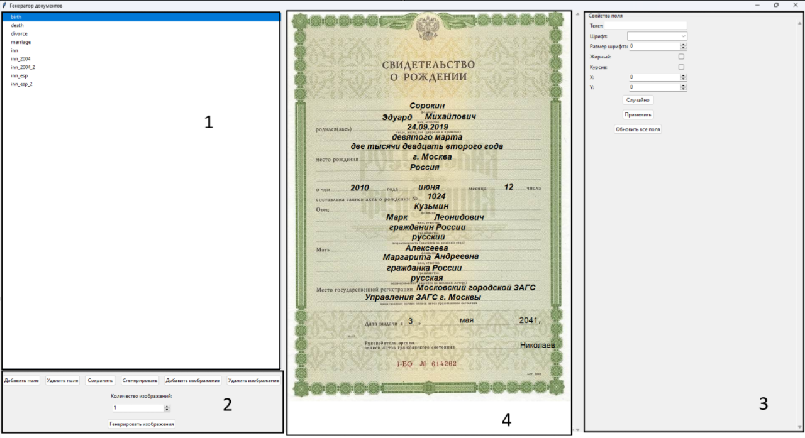
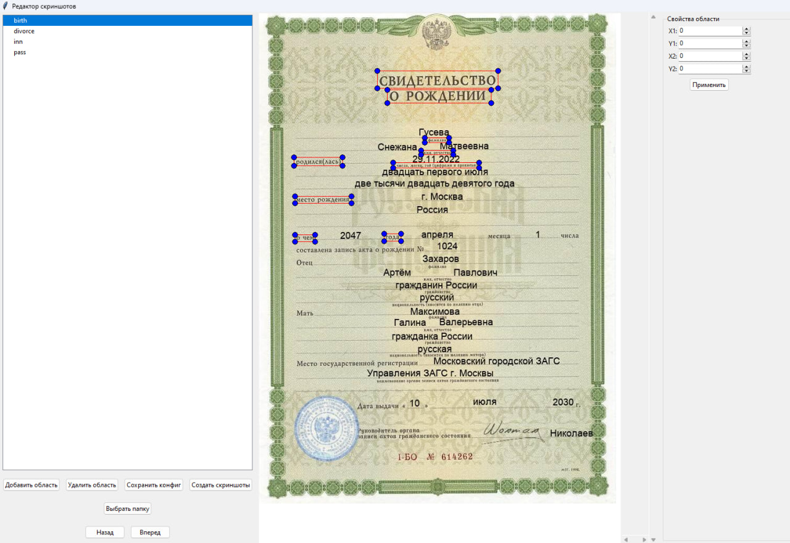

# ISandS

   
## Содержание
  - [Структура проекта:](#структура-проекта)
  - [Пояснение к template.py:](#пояснение-к-templatepy)
  - [Пояснение к screenshot.py:](#пояснение-к-screenshotpy)

## Структура проекта

#### исполняемые файлы выделены

 fonts — папка с фонами для template.py

 best.pt — обученные веса YOLO

#### app.py — API

работает через команду uvicorn app:app --reload в консоли в директории trainocr

#### app_gui.py — API с GUI

#### request.py — с помощью скрипта можно послать JSON на эндпоинт

 config.json — конфигурация для template.py

 config.json — конфигурация для screenshot.py

 google_colab_config.yaml — конфигурация для обучения YOLO

 rename.py — тестирование переименования output файлов

 requirements.txt — необходимые зависимости для проекта

#### template.py — программа для удобного размещения, настройки текста на шаблонах документов и удобной работы со случайным текстом из подготовленных файлов

#### screenshot.py — программа для создания датасета для оптического распознавания символов

 title.py — тестирование pytesseract

 yolotrain.ipynb — код для обучения YOLO

### trainocr — директория для обучения и тестирования распознавания символов
    Структура взята из EasyOCR репозитория и исправлена для корректной работы
    https://github.com/JaidedAI/EasyOCR
 all_data — директория с датасетом. 

 Делится на папку с train и val датасетами. Обязателен labels.csv файл с записями в формате названиефайла,размеченныйтекст

 config_files — директория с конфигом для обучения, гиперпараметры и параметры настраиваются тут

 model — веса моделей для тестирования

 modules — модули обучения

 saved_models — веса, которые сохраняются после обучения

 user_network — архитектура модели в .py файле и информация о модели в .yaml

 Временно тут находятся app, app_gui и best.pt из-за необходимости использования папок model и user_network для корректной работы фреймворка

 dataset.py, model.py, test.py, train.py, utils.py — файлы, взятые из репозитория, затем перенесенные в .ipynb для корректной работы блокнота. Остались в качестве возможности отката исправлений

 trainer.ipynb — код для запуска обучения модели

 trainer.py — код для тестирования обученной модели

## Пояснение к template.py

в окне 1 находятся  все доступные шаблоны (названия и пути указываются с помощью конфига в json, пример конфига config.json)

в окне 3 настройка текста. при нажатии на созданное поле можно выбрать текст, в окне отображаются его свойства. можно настраивать шрифт, координаты, а также есть кнопки применить (изменить свойства) и
кнопка "случайно", которая при нажатии открывает файловый диалог. надо выбрать файл формата .txt с разделенными переносом строки словами, например

Слово

Слово

в таком случае случайно выбирается какое-то слово из представленных в файле

на 2 окне основной функционал: добавить поле (появляется поле с текстом), удалить поле (для этого надо выбрать поле нажатием на него), сохранить  (для создания конкретного шаблона полей для разных шаблонов), сгенерировать (сохранить картинку с наложенным текстом), добавить изображение (добавляет изображение через файловый диалог), удалить изображение (удаляет последнее добавленное изображение)

количество изображений позволяет ввести и сгенерировать несколько изображений. в случае, если содержимое поля было выбрано кнопкой "случайно", автоматически обновляет поле новым случайным значением

шаблон появляется в окне 4

окна 1 и 3 изменяют размер перетаскиванием ближнего к 4 окну края

## Пояснение к screenshot.py

В программе можно выбрать папку, и оно будет искать все совпадения по ключевому слову перед последним _, а затем можно по ним проходить (назад, вперед). Размеченные боксы остаются на все экземпляры одного шаблона

В окне 2 есть возможность добавить область (новый бокс), удалить область (перед этим ее надо выделить, она станет зеленой), сохранить конфиг (сохранить текущие боксы), создать скриншоты (дается выбор папки куда сохранять), выбрать папку (для выбора по ключевым словам из окна 1), назад и вперед для прокрутки по экземплярам шаблона

В окне 3 можно изменить координаты области с помощью чисел при необходимости. Также область можно изменить протягиванием за синий угол или вручную в config_screenshot.json
